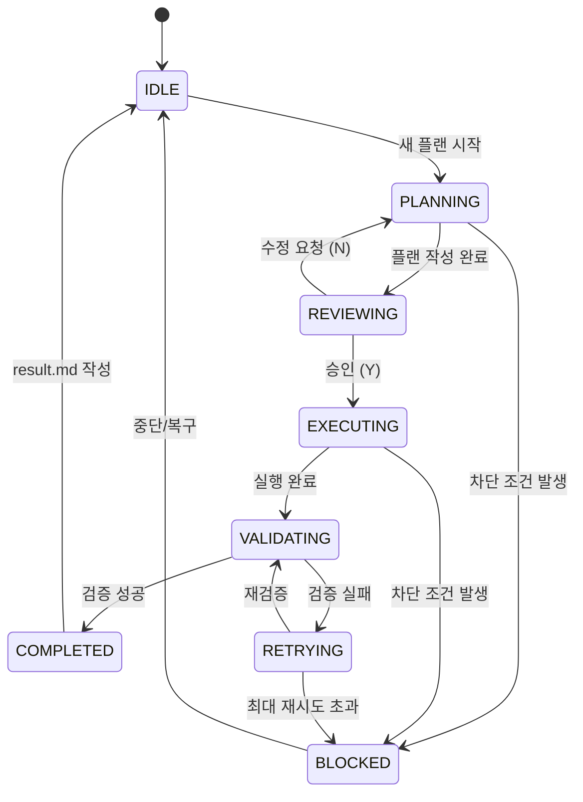

# Flow - AI 개발 워크플로우

## 개요

Flow는 AI 에이전트(Copilot)가 체계적으로 개발 작업을 수행하도록 조율하는 상태 기반 워크플로우 시스템입니다.
잊지 않기 위해, 순서를 지키기 위해, 그리고 사람이 판단해야 할 지점을 남겨두기 위한 작업 흐름입니다.

### 핵심 철학

- **플랜 우선**: 코드 수정 전 반드시 플랜 작성 및 승인
- **명시적 상태**: 모든 상태는 파일로 존재하며 추적 가능
- **역할 분리**: AI는 판단/조율, PowerShell은 실행/상태관리
- **되돌릴 수 있음**: 모든 변경은 되돌릴 수 있어야 함

---

## 빠른 시작

### 1. Flow 호출

VS Code에서 Copilot Chat에 다음과 같이 입력:

```
/flow 버튼 색상을 파란색으로 변경해줘
```

또는 `flow.prompt.md`를 첨부하고 요청을 입력합니다.

### 2. 플랜 검토 및 승인

AI가 플랜을 작성하면 검토 후 승인(Y) 또는 수정 요청합니다.

### 3. 자동 실행 및 검증

승인 후 AI가 플랜대로 구현하고, 자동 검증(빌드/린트)을 수행합니다.

---

## 상태 흐름 (State Flow)



### 상태 설명

| 상태 | 설명 | 가능한 행동 |
|------|------|------------|
| **IDLE** | 대기 상태 | 새 플랜 시작만 가능 |
| **PLANNING** | 플랜 작성 중 | 4개 필수 섹션 작성 |
| **REVIEWING** | 사용자 승인 대기 | 승인(Y) 또는 수정요청(N) |
| **EXECUTING** | 플랜 실행 중 | 플랜 단계 순차 수행 |
| **VALIDATING** | 검증 실행 중 | 빌드/린트/테스트 검증 |
| **RETRYING** | 재시도 중 | 에러 수정 후 재검증 (최대 5회) |
| **BLOCKED** | 차단됨 | 사람 개입 필요 |
| **COMPLETED** | 완료 | result.md 작성 후 IDLE 복귀 |

---

## 폴더 구조

```
.flow/
├── README.md                 # 이 문서
├── extensions.json           # 확장 상태 정의
├── validation-profiles.json  # 검증 프로파일 정의
├── memory/
│   └── principles.md         # Flow 핵심 원칙
├── scripts/
│   ├── common.ps1            # 공통 함수
│   ├── start-plan.ps1        # 플랜 시작 (IDLE → PLANNING)
│   ├── approve-plan.ps1      # 플랜 승인 (REVIEWING → READY)
│   ├── approve-design.ps1    # 설계 문서 승인 (독립 동작)
│   ├── complete-execution.ps1 # 실행 완료
│   ├── finalize-task.ps1     # 중단/복귀 (→ IDLE)
│   ├── validation-runner.ps1 # 검증 실행
│   ├── get-status.ps1        # 상태 확인
│   ├── human-input.ps1       # 사용자 입력 처리
│   ├── pop-backlog.ps1       # 백로그에서 다음 작업 가져오기
│   └── ensure-pwsh7.ps1      # PowerShell 7 설치 안내
└── templates/
    ├── plan-template.md      # 플랜 템플릿
    ├── design-template.md    # 설계 문서 템플릿
    ├── result-template.md    # 결과 템플릿
    └── extension-template.md # 확장 상태 템플릿

docs/
└── implements/
  └── <feature>/
    ├── context-phase.json # 기능별 상태 파일
    └── logs/
      ├── decisions.jsonl # 결정 로그
      └── backups/        # 상태 백업
```

---

## 스크립트 사용법

### 상태 확인

```powershell
cd .flow/scripts; ./get-status.ps1
cd .flow/scripts; ./get-status.ps1 -Json  # JSON 형식 출력
```

### 플랜 시작 (IDLE → PLANNING)

```powershell
cd .flow/scripts; ./start-plan.ps1 -Title "기능 이름"
cd .flow/scripts; ./start-plan.ps1 -Title "기능 이름" -Description "상세 설명"
```

### 플랜 승인 (REVIEWING → EXECUTING)

```powershell
cd .flow/scripts; ./approve-plan.ps1
cd .flow/scripts; ./approve-plan.ps1 -Comment "승인 코멘트"
cd .flow/scripts; ./approve-plan.ps1 -Force  # 체크리스트 무시
```

### 설계 문서 승인 (독립 동작)

```powershell
cd .flow/scripts; ./approve-design.ps1 -List  # Draft 문서 목록 조회
cd .flow/scripts; ./approve-design.ps1  # Draft 문서 자동 검색 후 승인
cd .flow/scripts; ./approve-design.ps1 -DesignFile "경로/설계문서.md"
```

### 실행 완료 (→ VALIDATING)

```powershell
cd .flow/scripts; ./complete-execution.ps1 -Summary "실행 요약"
```

### 검증 실행

```powershell
cd .flow/scripts; ./validation-runner.ps1 -Command "npm run build"
```

### 사용자 입력 처리

```powershell
cd .flow/scripts; ./human-input.ps1 -Type Confirm -Prompt "계속하시겠습니까?"
cd .flow/scripts; ./human-input.ps1 -Type Select -Prompt "선택하세요" -Options @("옵션1", "옵션2")
cd .flow/scripts; ./human-input.ps1 -Type Text -Prompt "입력하세요"
cd .flow/scripts; ./human-input.ps1 -Type Review  # 파일 열고 확인 대기
```

### 백로그에서 다음 작업 가져오기

```powershell
cd .flow/scripts; ./pop-backlog.ps1 -Preview  # 미리보기만
cd .flow/scripts; ./pop-backlog.ps1  # 다음 작업을 implements로 이동
```

### 중단/복귀 (→ IDLE)

```powershell
cd .flow/scripts; ./finalize-task.ps1 -Reason "사유"
```

---

## 검증 프로파일

`validation-profiles.json`에 정의된 프로파일:

| 프로파일 | 명령어 | 용도 |
|----------|--------|------|
| `nextjs` | npm run build, npm run lint | Next.js 프로젝트 |
| `typescript` | npx tsc --noEmit | TypeScript 타입 체크 |
| `powershell` | 스크립트 문법 검사 | PowerShell 스크립트 |
| `markdown` | 파일 존재 확인 | Markdown 문서 |

---

## 플랜 필수 섹션

모든 플랜은 다음 4개 섹션을 포함해야 합니다:

1. **입력 (Inputs)**: 필요한 파일, 데이터, 상태
2. **출력 (Outputs)**: 생성/수정될 산출물
3. **검증 방법 (Validation)**: 성공 여부 확인 방법
4. **완료 조건 (Done Criteria)**: Yes/No로 판정 가능한 조건

---

## 설계 문서 시스템

복잡한 기능은 플랜 전에 설계 문서를 작성합니다.

### 설계 문서 위치

`docs/implements/designs/` 디렉토리

### 설계 문서 상태

| Status | 설명 |
|--------|------|
| **Draft** | 작성 중 |
| **Reviewing** | 검토 대기 |
| **Approved** | 승인됨 → 플랜으로 분해 가능 |

### 설계 문서 흐름

1. 설계 문서 작성 (design-template.md 사용)
2. `./approve-design.ps1`로 승인
3. 승인된 설계는 여러 플랜으로 분해

---

## 확장 상태 시스템

Flow는 확장 상태를 통해 추가 검증/리뷰 단계를 동적으로 추가할 수 있습니다.

### 확장 파일 위치

`extensions.json` - 모든 확장 정의

### 기본 제공 확장

| 확장 ID | 설명 | 기본 상태 |
|---------|------|----------|
| `STRUCTURE_REVIEW` | 구조/리팩토링 리뷰 | ✅ 활성화 |
| `DESIGN_REVIEW` | 설계/아키텍처 리뷰 | ❌ 비활성화 |
| `TEST_SUGGESTION` | 테스트 케이스 제안 | ❌ 비활성화 |
| `SECURITY_REVIEW` | 보안 취약점 검토 | ❌ 비활성화 |

### 확장 실행 시점

```
EXECUTING → VALIDATING → [확장 상태들] → COMPLETED
                              ↓
                         (제안 수락 시)
                              ↓
                         EXECUTING (재실행)
```

### 새 확장 추가 방법

`/flow.ext` 명령어를 사용하거나 `extensions.json` 파일을 직접 수정:

```bash
# 확장 추가
/flow.ext add MY_REVIEW VALIDATING에서 커스텀 리뷰 실행

# 확장 활성화/비활성화
/flow.ext enable MY_REVIEW
/flow.ext disable MY_REVIEW

# 확장 목록 조회
/flow.ext list
```

또는 `extensions.json` 직접 수정:

```json
{
  "MY_REVIEW": {
    "id": "MY_REVIEW",
    "name": "커스텀 리뷰",
    "description": "VALIDATING에서 커스텀 리뷰 실행",
    "enabled": true,
    "priority": 15,
    "trigger": {
      "after": "VALIDATING",
      "condition": "validation_passed"
    }
  }
}
```

## 백로그 시스템

`docs/backlogs/` 디렉토리에서 작업 대기열을 관리합니다.

### 백로그 구조

```
docs/backlogs/
├── queue              # 작업 순서 (한 줄에 하나씩 기능 이름)
├── <기능이름>/
│   └── plan.md        # 승인된 플랜 (reviewed)
│   └── need-review-plan.md  # 미승인 플랜 (need-review)
```

### 백로그 사용

```powershell
# 다음 작업 확인 (이동하지 않음)
cd .flow/scripts; ./pop-backlog.ps1 -Preview

# 다음 작업을 implements로 이동
cd .flow/scripts; ./pop-backlog.ps1
```

### 출력 형식

```json
{
  "status": "success",
  "feature_name": "기능_이름",
  "plan_type": "reviewed",
  "message": ""
}
```

---

## 상태 전이 규칙

| From | To | 조건 |
|------|----|------|
| IDLE | PLANNING | 사용자 요청 |
| PLANNING | REVIEWING | 플랜 초안 완성 |
| REVIEWING | EXECUTING | 사람 승인 |
| REVIEWING | PLANNING | 수정 요청 |
| EXECUTING | VALIDATING | 실행 완료 |
| EXECUTING | BLOCKED | 에러 발생 |
| VALIDATING | COMPLETED | 검증 통과 |
| VALIDATING | RETRYING | 검증 실패 (5회 미만) |
| RETRYING | EXECUTING | 수정 후 재시도 |
| RETRYING | BLOCKED | 5회 초과 |
| BLOCKED | IDLE | 사람 개입으로 해결 |
| COMPLETED | IDLE | 작업 완료 |

---

## 추후 확장 가능한 상태/기능

### 🔍 분석 단계 확장

| 상태 | 설명 | 트리거 |
|------|------|--------|
| **CONTEXT_GATHERING** | 관련 파일/코드 자동 수집 | PLANNING 진입 전 |
| **IMPACT_ANALYSIS** | 변경 영향 범위 분석 | PLANNING 중 대규모 변경 감지 시 |
| **DEPENDENCY_ANALYSIS** | 의존성 그래프 분석 | 패키지/모듈 변경 시 |

### 📝 리뷰 단계 확장

| 상태 | 설명 | 트리거 |
|------|------|--------|
| **DESIGN_REVIEW** | 설계/아키텍처 리뷰 | 새 기능 추가 시 |
| **STRUCTURE_REVIEW** | 폴더/파일 구조 리뷰 | 리팩토링 시 |
| **IMPLEMENTATION_REVIEW** | 구현 코드 리뷰 | EXECUTING 완료 후 |
| **SECURITY_REVIEW** | 보안 취약점 검토 | 인증/권한/입력 처리 변경 시 |

### 🧪 테스트 단계 확장

| 상태 | 설명 | 트리거 |
|------|------|--------|
| **TEST_SUGGESTION** | 테스트 케이스 제안 | 새 함수/컴포넌트 추가 시 |
| **TEST_GENERATION** | 테스트 코드 자동 생성 | TEST_SUGGESTION 승인 후 |
| **COVERAGE_ANALYSIS** | 테스트 커버리지 분석 | VALIDATING 단계 |

### 📚 문서화 단계 확장

| 상태 | 설명 | 트리거 |
|------|------|--------|
| **DOCUMENTING** | API/컴포넌트 문서 생성 | 공개 인터페이스 변경 시 |
| **CHANGELOG_UPDATE** | 변경 로그 자동 갱신 | COMPLETED 단계 |

### 🔄 복구/롤백 확장

| 상태 | 설명 | 트리거 |
|------|------|--------|
| **ROLLBACK** | 이전 상태로 복구 | BLOCKED에서 복구 선택 시 |
| **PARTIAL_ROLLBACK** | 부분 변경 취소 | 특정 단계 실패 시 |

### 🚀 배포 연동 확장

| 상태 | 설명 | 트리거 |
|------|------|--------|
| **PR_READY** | PR 생성 준비 | COMPLETED 후 사용자 요청 시 |
| **DEPLOY_PREVIEW** | 프리뷰 배포 | PR 생성 후 |

### 💡 추천 확장 기능

| 기능 | 설명 | 가치 |
|------|------|------|
| **스마트 컨텍스트** | 관련 파일 자동 감지 및 수집 | 플랜 품질 향상 |
| **변경 영향 분석** | 수정 시 영향받는 파일 목록 | 사이드 이펙트 방지 |
| **자동 테스트 제안** | 변경에 맞는 테스트 케이스 제안 | 품질 보증 |
| **리팩토링 감지** | 반복 패턴 감지 및 개선 제안 | 코드 품질 |
| **성능 힌트** | 성능 이슈 가능성 경고 | 성능 최적화 |
| **접근성 검토** | UI 변경 시 a11y 체크리스트 | 사용성 |

---

## 확장 구현 가이드

### 새 상태 추가 방법

1. `flow.prompt.md`에 상태 정의 및 행동 규칙 추가
2. 필요시 `scripts/` 폴더에 전이 스크립트 추가
3. docs/implements/{feature}/context-phase.json 의 `phase` 필드에 새 상태 값 허용

### 새 검증 프로파일 추가

`validation-profiles.json` 수정:

```json
{
  "profiles": {
    "my-profile": {
      "commands": ["my-command"],
      "description": "설명"
    }
  }
}
```

### 새 템플릿 추가

`templates/` 폴더에 `*-template.md` 형식으로 추가

---

## 문제 해결

### 상태가 BLOCKED에서 멈춤

```powershell
cd .flow/scripts; ./finalize-task.ps1 -Reason "수동 복구"
```

### 상태 파일 손상

기능별 `logs/backups/`에서 최신 백업 복원:

```powershell
Copy-Item "docs/implements/<feature>/logs/backups/phase-YYYYMMDD-HHMMSS.json" "docs/implements/<feature>/context-phase.json"
```

### PowerShell 인코딩 문제

PowerShell 7 사용 권장:

```powershell
cd .flow/scripts; ./ensure-pwsh7.ps1
```

---

## 참고 문서

- [Flow 핵심 원칙](memory/principles.md)
- [플랜 템플릿](templates/plan-template.md)
- [설계 문서 템플릿](templates/design-template.md)
- [결과 템플릿](templates/result-template.md)
